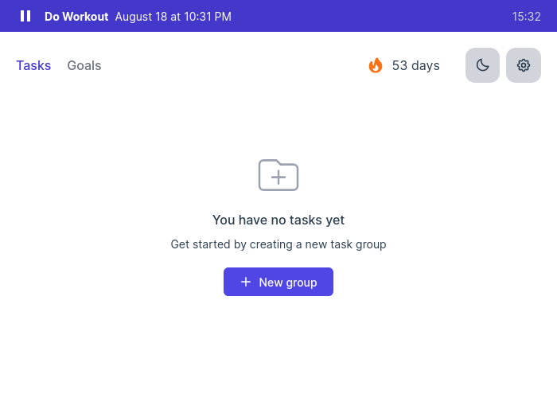

 

  

<b>Reject humanity, become Astam Adam</b>

<!-- line -->
<h1></h1> 

Astam is a desktop application that aims to improve your emotional state and enhance your personality. The app provides many tools to analyze your development path. Features:

- 🔥 <b>Smart tasks</b> — burnout protection and daily plan generator 
- 🚩 <b>Goals</b> — set goals and see progress
- 😀 <b>Emotion tracker</b> — learn how to control your emotions 
- 🕔 <b>Time tracker</b> — watch out for wasting time
- 🛠 <b>Hackable</b> — automatic track your progress from other resources

## Gallery

  

